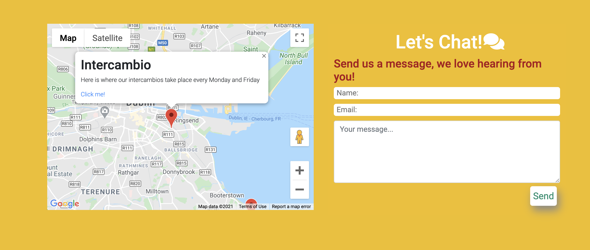

<h1 align="center">
  <a href="https://donnaib.github.io/spanish_quiz/">Spanish Quiz</a>
</h1>


[View Spanish Quiz in GitHub Pages](https://donnaib.github.io/spanish_quiz/)


*Note: This is an extension to the fictional organisation created for my Code Institute milestone one project.*

## Introduction
The organisers of Dublin Intercambio wanted to create an additional learning resource for the people that attend their language exchanges.  They know that building vocabulary is a key element to improving your fluency of the language. They have created a bank of questions based on conversations they have with the language exchange participants, when they overhear participants commenting on a new word they have learned as well as adding their own interesting words or phrases that you won't find in a text book.

## Scope 

Create a simple, intuitive, and responsive website that hosts a quiz to help their participants learn and provided another way to advertise their intercambio events. 

The site should have a minimalistic feel with the focus being the quiz to provide a simple, fun and intuitive to use, language learning tool.  

The structure should adhere to convention and be simple and intuitive, ensuring the user always knows where they are, how they got there and how to get back to 
where they started.

The design should be similar to the Dublin Intercambio website, utilising the same colour palette, however as the focus is the quiz there will be no images used in this site, this will help to
focus the users attention in the questions and answers.

Any addition features or functionally are out of scope at this stage.

User goals:
* To enhance their Spanish vocabulary
* To find out how to take part in a language exchange
* To improve their language skills

Website owners goals:
* To create a fun and interactive quiz with no errors
* To provide a free learning tool to their intercambio attendees and the wider public
* To provide a way for users to interact with the organisers
* To use the free quiz to further advertise their intercambio events
 
## UX

#### User stories

##### A typical user of this site would:
* Have an interest in learning new Spanish words and phrases
* Have an interest in learning beyond a textbook
* Speak English and Spanish (to some level)

##### This project is the best way to help them achieve these things because:
* The vocabulary and phrases used in this quiz are based on real conversations that happen in our intercambios instead of the standard vocabulary you find in text books.
* Users can submit their own suggestions for words or questions to add to the question bank, interesting words they recently learned, or interesting phrases.
* The Spanish Quiz website:
    * Is easy to navigate.
    * Is part of the Dublin Intercambio community and as such has a warm, friendly and inviting feel to it.
    * Ensures the important information is easy to find and access.
    * Encourages users to attend the events and get involved.

##### User stories
1. As a new visitor to the website, I want to understand how to take part in the quiz.
2. As a new visitor to the website, I learn some new Spanish vocabulary.
3. As a new visitor to the website, I want to find out more about the Dublin Intercambio community.
4. As a returning visitor to the website, I want to practise vocabulary and learn new vocabulary.
5. As a returning visitor to the website, I want to suggest new questions to help others in the language exchange community.


### Design (Wireframes and Mockups): 
With this site, I wanted to keep the design very simple, and create a connection with the [Dublin Intercambio](https://donnaib.github.io/dublin_intercambio/) site by utilising the same color palette.
As I always like to do, I began the process of creating wireframes with good old fashioned pen and paper to get a very rough skeleton of the site based on the best layout for the required functionality.

With a basic sketch created I moved to Balsamiq to create more detailed Wireframes for the site. 

### Wireframes

#### Mobile View


#### Larger Screen View


As with my previous project I was very aware that working with yellow in the colour pallete can be problematic. However, as before I was careful to utilize the color in a way that added to the design of the site, but didn't not compromise the accessibility of the site.

## Features

### Pages 

##### Home
As the quiz is the main feature of this site, the home page features an introduction to the quiz and allows users to get start right away with the quiz thanks to a prominent 'Start' button.  

The brief introduction on this page is design to be short and informative. Providing enough information for the users to understand the background, the purpose, and the structure of the quiz, but not too much, that a potential user becomes bored and navigates away from the quiz.

Each time a user plays the quiz, they are given 5 questions, chosen at random from the question bank. They are given a question and are presented with 4 possible answers.

The yellow, green and red from the colour pallete are integral in this page. The yellow is the starting, neutral background, that then changes to either red or green depending on whether the user answers the questions correctly.  This provides fun, visual, and instance feedback to the user on their progress throughout the quiz.  

There is also a score counter in the top right hand corner of the quiz container that counts the users score and they progress. Once a user has completed the quiz, a pop up appears giving the users the option to restart the quiz or save their score (using local storage).

The quiz is response and the layout of the questions and answers adapts to different screen sizes.

##### About
The about page establishes the link between this quiz site and the sister Dublin Intercambio site. It tells the story of how this site came about, provides links to the sister site for further information about the language exchanges and also explains to the user how they can help build upon the quiz by submitting suggestions for words of phrases, with a link to the contact page when the use can submit a suggestion using the contact form.

##### Add Name (hidden page)
The page is hidden and doesn't feature in the navigation, this page is only visible when a users clicks on the Save Score button that appears in the modal once a user has completed the quiz. 

This page features a form, to allow the user to enter then name to enable their score to be recorded on the Scores page.

##### Scores
The scores page allows users to view their recent scores using local storage. This page initially displays two buttons, providing the user the option to either play the quiz again or to view recent scores.  If the user chooses to view recent score, the buttons are hidden and recent scores are displayed, showing the username that the user entered and their score.

##### Contact
The contact pages features map, courtesy of google maps zoomed in to the area with Dublin Intercambio (parent organisation) is situated, and has markers added to show the location of Dublin Intercambio HQ (fictional) and where the Dublin Intercambio language exchange events take place.

The page also features a contact form, to allow users to contact the website owners. The contact form is connected to the website owners GMail account using Email JS, meaning they will receive an email each time someone submits a form.

The form fields have validation added to ensure all fields are completed and have the correct type of data entered.  In additional there is confirmation alert to visually show the user that the form has been successfully submitted and a fall back error message asking the user to try again later should the form fail to submit for some reason.

### Site Features 
Every page on this site also incorporates the following features:
* A logo in the top left hand corner, that not only forms part of the branding and design of the site but also as is consistent with a user's expectations, clicking the logo will return the user to the 
home page of the site.
* A responsive, collapsible navigation bar, allowing users to easily navigate the site on any device.
* A responsive footer with social media links. allowing users to easily connect with Dublin Intercambio (parent organisation) via social media. Each link opens in a new tab.

### Possible Features to Implement in Future
- Adding users scores to a database to allow some friendly competition between users.
- Adding GDPR compliant Privacy and Cookie polices.

## Technologies Used for building this site
- This project uses HTML, CSS and JavaScript programming languages.
- Gitpod was used an the IDE for building the site.
- **Bootstrap4** was used to assist with the structure, responsiveness and browser compatibility of the site. 
- BootstrapCDN was used to provide icons from **Font Awesome**. 
- **Google fonts** was used to style the website fonts.
- **jQuery** to reference Javascript needed for the responsive navbar.
- **Popper.js** reference Javascript needed for the responsive navbar.
- **Google Maps** to create map and markers on contact page.
- **EmailJS** to connect the contact form to website owners Gmail account.

## Testing

I tested the site in the following ways:

1. Initially I used the inspector tool to test the site in all the screen sizes and devices available in the Chrome developer tool.  In addition to this I also tested it on live devices, including but not limited to iPhone, iPad, MacBook Pro, MotoG7. 

2. I also tested my code using the validator tools for both my HTML [W3C HTML Validator Tool](https://validator.w3.org/), CSS [W3C CSS Validator Tool](https://validator.w3.org/) and I also checked my JavaScript code using [JSHint](https://jshint.com/) Running my code through these tools highlighted a few issues with syntax which have been fixed.

Screen shots of the HTML & CSS validator results can be viewed below, as you can see there were no errors detected.


3. All links were tested to ensure there were no broken links and that all links to external sites open in a new tab.

4. In addition to testing with the inspector tool, real devices and validation tools, I also work through a series of test cases, to ensure that the site met the users stories and that any functionality that was added worked as intended.

### User Story Test Cases
1. As a new visitor to the website, I want to understand how to take part in the quiz. 

On the home page users are greeted with an introduction to the quiz that explains how the quiz works. In addition buttons are added and removed as user progress through the quiz to nudge the users to take the next action and make sure that it is intuitive.


2. As a new visitor to the website, I learn some new Spanish vocabulary.

There is a bank of questions that will evolve and grow of questions that will enable users to learn new words and phrases.  The fact that each time the users is given 5 questions at random from the question bank, means that they can learn new words and phrases will practising the ones that they have seen before.


3. As a new visitor to the website, I want to find out more about the Dublin Intercambio community.

 If a user wants to find out about the language exchange / intercambio events there are a number of places within the site that this is possible. There are 2 references on the Abouts page that refer to  Dublin Intercambio with a link to that site and also on the contact page, one of the markers on the map is the location of the language exchange events again with a link to the Dublin Intercambio event.





4. As a returning visitor to the website, I want to practise vocabulary and learn new vocabulary.

Learning a language and specifically new words and phrases is more than seeing a word once then being able to remember it and use it the next time they have a conversation in that language.  The fact that this quiz provides a random selection of questions means that users can keep coming back to this quiz and use it as part of their language studies. The balance of possible new words and the repetition of others means that over time users will build up their vocabulary.


5. As a returning visitor to the website, I was to suggest new questions to help others in the language exchange community.

The site owners are keen to ensure this has involvement from their community involvement so they ask people to submit any words or phrases that they think would enhance the quiz.  There is a call for this on the About page where users are then directed to the contact page to submit their suggestions.


### Functionally Test Cases

Quiz:
1. Firstly double check the question.js file to ensure that the correct answers are marked as 'correct: true' and the wrong answers as 'correct: false'.
2. Click the 'start' button and ensure that the quiz information is hidden and that the first question is correctly is displayed.
3. Chose an answer to the questions and ensure that the 'next' button becomes visible to allow the user to move on.
4. Answer 5 questions and ensure the modal appears displaying the correct score and buttons to allow the user the option to restart or save there score.
4. Complete the quiz as many times as it takes to ensure that all questions have appeared and ensure that firstly selecting the correct answer results in the correct response (background turns green, buttons turn red or green depending if they are correct or not, and 1 is added to the score), and secondly that selecting the wrong answer results in the appropriate response (background turns red, buttons turn red or green depending if they are correct or not, and 0 is added to the score).

Score:
1. Play the quiz and ensure that when choosing a correct answer that 1 is added to the score.
2. Play the quiz and ensure that when choosing a incorrect answer that 0 is added to the score.
3. Answer 5 questions and check the score displayed on the modal is correct.
4. On the modal select 'Restart' and ensure that the score is reset to 0/5.
5. After selecting 'Restart' play the quiz again and ensure that the 1 point is added for a correct answer and 0 for an incorrect answer.

Save Score:
1. Play quiz and answer all 5 questions, when the modal appears select 'Save Score', ensure that you are redirected to addName.html and that the form appears to allow user to enter their name.
2. Enter name and click 'Save' button and ensure you are redirected to scores.html and that 'View Scores' & 'Play Again' buttons are visible.
3. Click 'View Scores' and ensure that users name and score is displayed and buttons are hidden.
4. Repeat steps 1-3 but this time instead of clicking the 'Save' button in step 2, click the enter key'.
5. Repeat steps 1-2 then click 'Play Again' button and ensure you are redirected to index.html.

Email:
1. Without entering any details attempt to submit the form. Ensure that validation errors are displayed.
2. Enter data into the form one field at a time to test all validation errors are shown when a field is empty.
3. Enter data into the email field that is not in email format and ensure the validation error appears.
4. Enter correctly formatted data in each field and ensure that success message alert is shown and that the correct data has been receive via email to the associated Gmail account.
5. With service ID temporarily removed in the email.js file, enter correctly formated data in each field and ensure that failure message alert is shown.


Map: 
1. Navigate to the contact page and ensure that the map renders correctly, showing south Dublin and that both markers are visible.
2. Click on each marker ensure information window appears with relevant information is displayed.
3. Click on each marker and then click the links, ensure both links open the Dublin Intercambio site as a new tab.
4. Click on each marker and close with 'x' in the top right hand corner.
5. Click on one marker, after the info window has appeared, click on the other marker, ensure that the first info window closes and the new info window opens.

Links:
1. Click on each social media link in the footer and ensure that the correct social media accounts open in a new tab.
2. Clink on each navigation link on each html page ensuring that you are taken to the correct page.
3. Navigate to the About page and test the 3 links within the text.  Ensure clicking on both references to Dublin Intercambio, open the Dublin Intercambio site in a new tab.
4. Still on the About page, click the link to the contact form, and ensure it redirects the user to the contact page within the same tab.

### Accessibility
In addition to all the above testing I also checked my site with accessibility tools in the inspector. 

### Bugs
During development and testing I found some small bugs related to href links, responsiveness and errors in the content.

There were 2 specific bugs that I discussed with my mentor and were good for me to learn.  One was related to the score counter, I had used ++score to increment the score however this was causing some unexpected behaviour.  I discussed the issue with my mentor and we looked at the difference between ++score and score++. Based on my new understanding of the difference between these two things, I updated my code and achieved the expected behaviour.

The second bug was related to a user adding them name when saving their score.  While I had already got the feature working with the 'Save' button, I was keen to ensure, from a UX perspective, that users could submit the form by using the enter button on their keyboard.  After reviewing my code together with my mentor, we realised that while my code for this was correct, the form element in the associated html file was causing default behaviour that was overriding what I was trying to achieve. I removed the <form> element and that fixed the bug.

## Deployment

To deploy this page to GitHub Pages from its [GitHub repository](https://donnaib.github.io/spanish_quiz/), the following steps were taken: 
1. Log into GitHub. 
2. From the list of repositories on the screen, select 
3. From the menu items near the top of the page, select **Settings**.
4. Scroll down to the **GitHub Pages** section.
5. Under **Source** click the drop-down menu labelled **None** and select **Master Branch**
6. On selecting Master Branch the page is automatically refreshed, the website is now deployed. 
7. Scroll back down to the **GitHub Pages** section to retrieve the link to the deployed website.

At the time of submission, the Development Branch and Master Branch were identical. 

### How to run this project locally
To clone this project from GitHub:
1. Follow this link to the [Project GitHub repository](https://donnaib.github.io/spanish_quiz/).
2. Under the repository name, click 'Code'


3. In the Clone with HTTPs section, copy the clone URL for the repository. 
4. In your local IDE open Git Bash.
5. Change the current working directory to the location where you want the cloned directory to be made.
6. Type ```git clone```, and then paste the URL you copied in Step 3.
```console
git clone https://github.com/DonnaIB/spanish_quiz.git
```
7. Hit enter and your local clone will be created.

## Credits

### Content
The content of the site was written by myself and inspired by my Ms1 fictional project.

### Code
- Code for my navigation was adapted from my Ms1 project which in turn was adapted and customised from a code snippet found in the Bootstrap documentation.
- Code for my footer was adapted from my Ms1 project. 
- Code for the contact form taken from my Ms1 project and adapted and enhanced for this project.
* I watched a number of JavaScript quiz Youtube videos in preparation for this project including the following [How to Make a Quiz App using HTML CSS Javascript](https://www.youtube.com/watch?v=f4fB9Xg2JEY) which the code for my Scores and Add Name pages were based on.

### Acknowledgements
* My color scheme for this site was based on the colors in the Spanish flag and I used a colour scheme from [Scheme Color](https://www.schemecolor.com/spain-flag-colors.php), the specific color combination was created by user Keshav Naidu.
* I referenced 'HOW TO GOOGLE MAPS', a document created by Eamonn and available on Slack. That document, together with the Google Maps documentation, helped me with the map on my contact page.
* Thank you to Tim Nelson and Eamonn Smyth in the Slack community for helping me with problem in my score.js file.
* I referred my previous README file which was influenced by AJ Greave's sample README as well as the Code Institute sample to help structure this README file.
* A final thank to my mentor Aaron Sinnott who has advised and guided me through this milestone 2 project.
